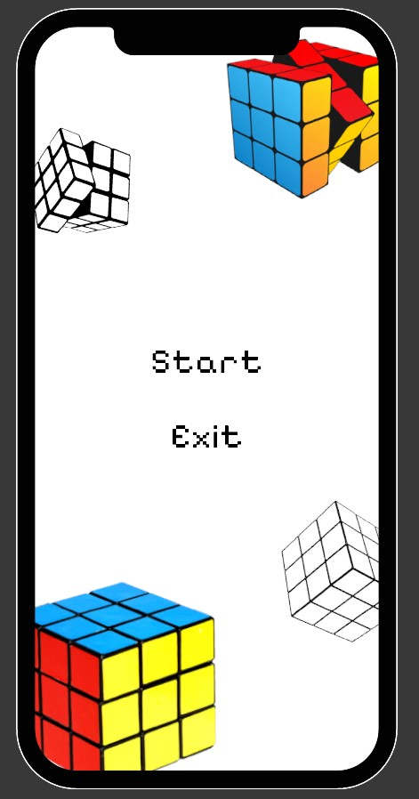
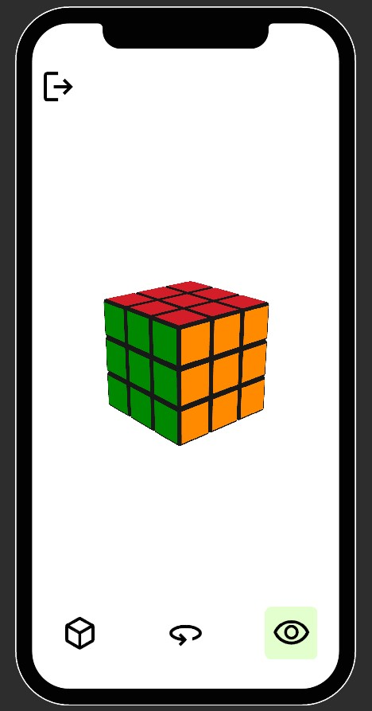

# CubePuzzle

## Description

**Unity version:** 2022.3.43f1

Application to play with Rubik's cube on mobile devices.

# Screenshots

## Installation

Open the Unity project, click `File`->`Build Settings...` switch to the Android platform, and click the `Build` button. Install the file with the '.apk' extension on your device and run the application.

## Authors and acknowledgment

Ihor Reznichenko

### Plugins

| Plugin name            | Version      | Notes                                                                                                                |
|------------------------|--------------|----------------------------------------------------------------------------------------------------------------------|
| TextMeshPro            | ver. 3.0.6   | [Link](https://docs.unity3d.com/Packages/com.unity.textmeshpro@3.0/manual/index.html)                                |